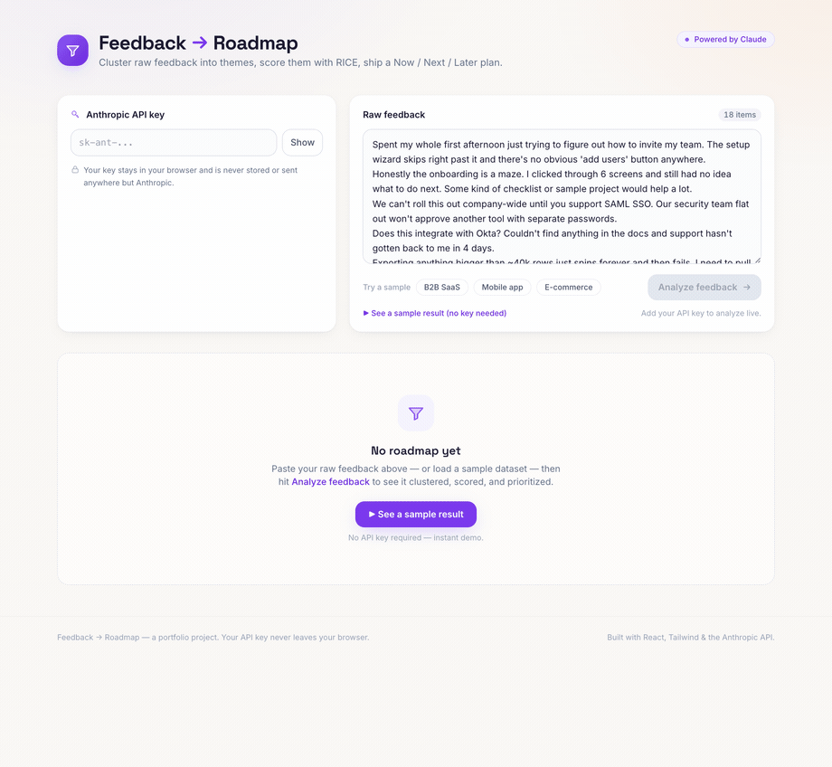

# Feedback → Roadmap

[](https://github.com/aalamkh/sift/actions/workflows/ci.yml)

**Turn a pile of raw product feedback into a RICE-prioritized Now / Next / Later roadmap — in one click.**

Paste support tickets, app-store reviews, and sales notes; the app clusters them into themes, proposes RICE scores, and lays out a prioritized roadmap you can tune by hand and export as Markdown.



> _Demo GIF placeholder — drop a screen recording at `docs/demo.gif`._

---

## What it demonstrates

This is a portfolio project built to show **product thinking**, not just front-end plumbing. For a PM audience, it exercises:

- **RICE prioritization** — every theme is scored with Reach × Impact × Confidence ÷ Effort, the standard framework for defensible, comparable prioritization decisions.
- **Synthesis of unstructured feedback** — the hard PM skill of reading dozens of messy, contradictory, first-person complaints and distilling them into a handful of coherent problems worth solving.
- **AI product thinking** — using an LLM where it's genuinely good (fuzzy clustering, summarization, sentiment) while keeping the structured math (scoring, bucketing, sorting) in deterministic code.
- **Human-in-the-loop scoring** — the AI proposes a *starting estimate*; the human keeps the judgment. Every RICE input is editable, and the roadmap re-prioritizes live as you adjust.

## Features

- 🧠 **AI theme clustering** — groups raw feedback into 3–7 distinct product problems, each with a name, one-line need statement, representative quotes, and sentiment.
- 📊 **RICE scoring** — AI proposes Reach / Impact / Confidence / Effort; the score is computed deterministically in code.
- ✏️ **Editable inputs, live re-ranking** — tweak any RICE input and watch themes re-bucket and re-sort instantly.
- 🗂️ **Now / Next / Later roadmap** — color-coded buckets (warm → neutral → cool) with scores visible at a glance.
- 📝 **Executive rationale** — generate a short, decisive summary of what to tackle now and what's deferred.
- 📋 **Markdown export** — copy the full roadmap (themes, buckets, scores, rationale) to your clipboard.
- 🎛️ **Sample datasets** — three built-in feedback sets (B2B SaaS, mobile app, e-commerce) to try it instantly.
- 🔒 **Bring your own key** — your Anthropic API key stays in memory in your browser; it is never stored or proxied.

## Tech stack

React + TypeScript + Vite · Tailwind CSS · Vitest · the Anthropic Messages API (called directly from the browser).

## Setup

```bash
# 1. Install dependencies
npm install

# 2. Run the dev server
npm run dev          # → http://localhost:5173

# 3. (optional) Run the unit tests
npm test

# 4. (optional) Production build
npm run build
```

Then open the app, paste your Anthropic API key, load a sample (or paste your own feedback, one item per line), and hit **Analyze feedback**.

### Bring your own API key

The app does **not** ship with an API key and has no backend. You provide your own
[Anthropic API key](https://console.anthropic.com/) at runtime in the input field. It's held in React state **in memory only** — never written to `localStorage`/`sessionStorage`, never read from an env var, and never sent anywhere except `api.anthropic.com`. Refresh the page and it's gone.

> Because the call goes straight from the browser to Anthropic, the client sends the
> `anthropic-dangerous-direct-browser-access: true` header. That's appropriate for a
> single-user, bring-your-own-key tool like this; a multi-user product would proxy
> the call through a backend instead.

## How the AI works

The app makes **two separate** Anthropic Messages API calls (model: `claude-sonnet-4-20250514`). Both prompts are intentionally explicit and constrained.

### 1. Analysis — cluster feedback into scored themes

Sent when you click **Analyze feedback**. The system prompt instructs the model to act as a senior PM and return **strict JSON only**:

```
You are a senior product manager analyzing raw user feedback.
Below is a list of unstructured feedback items. Your job:
1. Group them into 3-7 distinct themes. Each theme is a coherent product
   problem or opportunity, not a vague category.
2. For each theme write a theme name (max 5 words) and a one-sentence
   description of the underlying need.
3. Count how many feedback items map to each theme.
4. Extract up to 2 short representative quotes per theme, verbatim,
   trimmed to under 15 words each.
5. Assess overall sentiment per theme: "negative", "mixed", or "positive".
6. Propose RICE inputs as a starting estimate:
   - reach: integer, users affected per quarter (scale from item count)
   - impact: one of 0.25, 0.5, 1, 2, 3
   - confidence: one of 0.5, 0.8, 1.0
   - effort: integer person-months, minimum 1
Return ONLY valid JSON, no preamble, no markdown fences, in this shape:
{ "themes": [ { "name": string, "description": string, "count": number,
  "sentiment": "negative"|"mixed"|"positive", "quotes": [string],
  "rice": { "reach": number, "impact": number, "confidence": number,
  "effort": number } } ] }
```

The client strips any stray ```` ```json ```` fences, parses the JSON, **validates the shape**, and then **recomputes the RICE score in code** from the model's inputs (so the math is never the model's job).

### 2. Rationale — write the executive summary

Sent when you click **Generate rationale**, with the themes serialized as JSON, sorted by RICE:

```
You are a product lead writing a brief roadmap rationale. Given these
prioritized themes with RICE scores, write a 2-3 sentence executive
summary explaining the prioritization: what to tackle Now and why, and
what is deliberately deferred. Be specific and decisive. Return plain
text only.
Themes (sorted by RICE, highest first): {THEMES_JSON}
```

## Design decisions

A few choices that reflect how I think about building with AI:

- **RICE inputs are editable — judgment stays with the human.** The model is great at a fast first pass over messy text, but Reach/Impact/Confidence/Effort encode real business judgment (market size, strategic bets, eng cost) the model can't know. So the AI's numbers are an *editable starting estimate*, not a verdict. You override any input and the roadmap re-prioritizes instantly — the tool accelerates the decision without taking it away.

- **Strict JSON output is enforced.** The analysis prompt demands a fixed JSON schema with no prose or markdown fences, and the client validates the shape before trusting it. Free-form model output is unreliable to parse and would break the UI; a contract + validation makes the AI a dependable component of a deterministic pipeline rather than a wildcard. The scoring arithmetic and bucketing then live in plain, unit-tested TypeScript ([`src/lib/rice.ts`](src/lib/rice.ts)).

- **Analysis and rationale are separate calls.** They're different jobs at different moments. Clustering is expensive and runs once; the rationale is cheap, optional, and only makes sense *after* you've tuned the RICE inputs — so it can reflect *your* numbers, not the model's first guess. Splitting them keeps each prompt small and single-purpose, lets you re-generate the summary without re-running the whole analysis, and means editing a score never triggers a costly round-trip.

## Tests

Deterministic scoring logic is covered by Vitest:

```bash
npm test
```

[`src/lib/rice.test.ts`](src/lib/rice.test.ts) covers `computeRiceScore`, `sortThemesByScore`, and `bucketThemes`, including edge cases (effort `0`, empty arrays, single themes, and inclusive bucket boundaries).

---

_A portfolio project. Built with React, Tailwind, and the Anthropic API._
